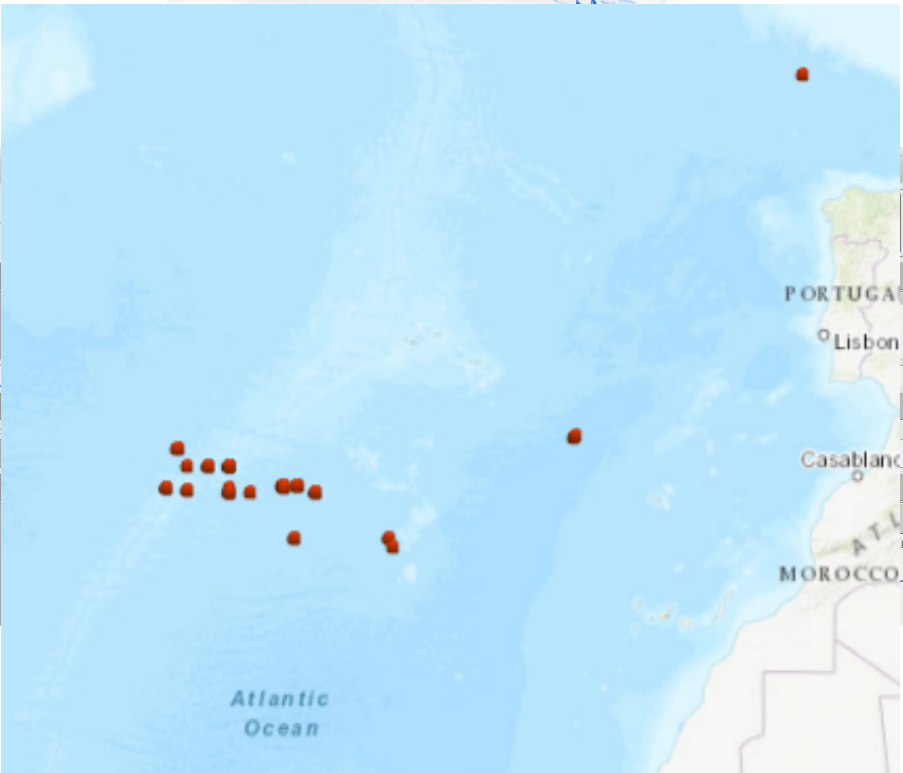
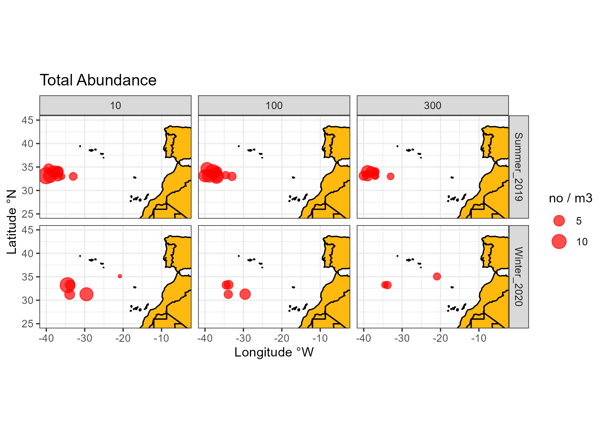
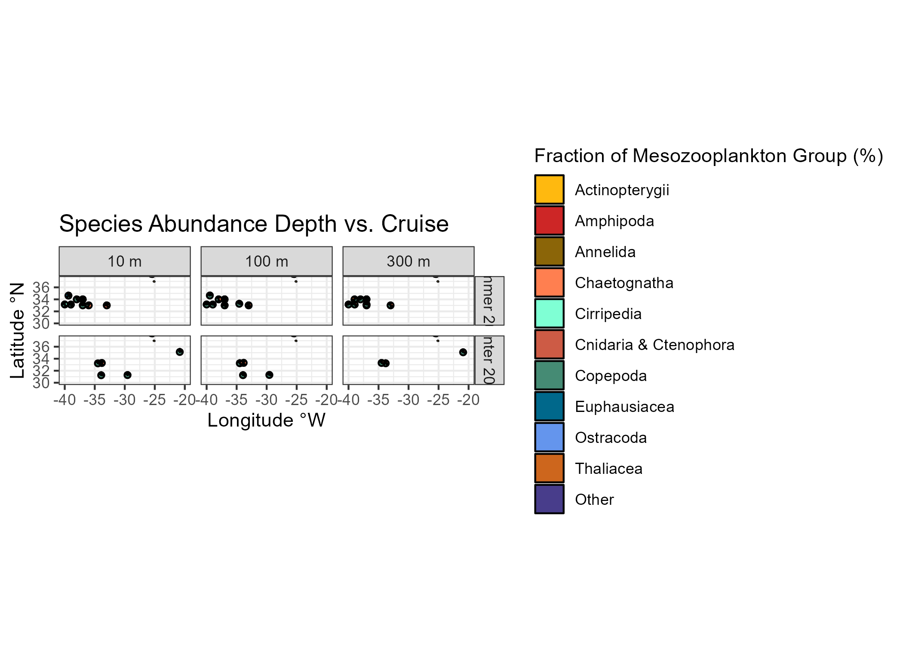
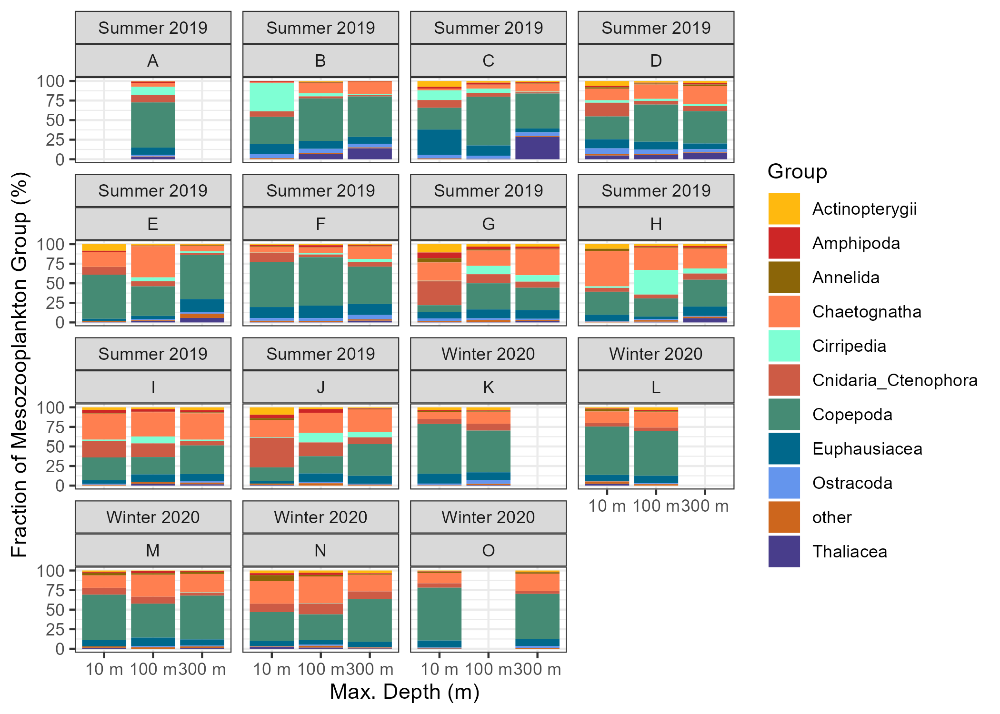

# POS536

## Data analysis of zooplankton data collected on POS536 and SO279

### Cruise summary
The expedition POS 536 is part of a multi-disciplinary research initiative of GEOMAR
investigating the origin, transport and fate of plastic debris from estuaries to the oceanic garbage patches. The main focus will be on the vertical transfer of plastic debris from the surface and near-surface waters to the deep sea and on the processes that mediate this transport. The obtained data will help to develop quantitative models that provide information about the level of plastic pollution in the different compartments of the open ocean (surface, water column, seafloor).

Cruise track POS536 available on ???
Cruise track SO579 available on https://doi.pangaea.de/10.1594/PANGAEA.933671
Hydrography POS536 available on ???
Hydrography (TSG) SO579 available on https://doi.pangaea.de/10.1594/PANGAEA.937906
Cruise report POS536 available on https://oceanrep.geomar.de/id/eprint/50735/

Fig. 1: Overview of stations sampled during both cruises (from Ecotaxa).

### Sampling
A bongo net (HYDRO-BIOS Kiel) with a 22 kg V-fin depressor and with a 300 μm mesh size
on both nets was used to sample different water depths (Figure 5.4-1a+b). The bongo net was
equipped with two depth loggers (Star Oddi), which recorded the water depth during towing,
as well as with a mechanical flowmeter with back-run stop (HYDRO-BIOS Kiel) to measure
the water volume that passed through the net bags during deployment. The net bags were rinsed
with filtered seawater (20 μm) before the first deployment and were again rinsed after each
further deployment to wash the retained material into the collectors that were at the end of the
net bags. At each station the bongo net was deployed three times to sample in 10 m, 100 m and
300 m depth for 30 minutes at 2 knots ship speed. The bongo net was lowered with
0.7 m/s and hoisted with 0.5 m/s rope speed. After each deployment the ship returned to its
initial position.

### Scanning procedure
Using Epson V750 Pro flatbed scanner at 2400dpi, scanned "lrg" size fraction only (>1000µm), either the entire sample or split (1/4 or 1/8). Processed using ZooProcess.

### Image Analysis
Images data are on https://ecotaxa.obs-vlfr.fr/prj/3346 and were sorted into taxonomic categories. Using the export file (.tsv; has to be downloaded locally into the forked repos; too large file size for github), individual biomass can be calculated from image area and taxonomic identity. Abundance and biomass are then aggregated to concentrations (per volume) or integrals (per area).

Figure 2. Total abundance as total number of individual per m^3 shown at the geographical location of their station per sampling depth and cruise.

Figure 3. Pie chart of abundance contribution of major groups (factions >5%) shown at the geographical location of their station per sampling depth and cruise. Objects that overlapped were catergorized as multiple and excluded from analysis. Fraction "Other" contains: Appendicularia, Bryozoam Cephalopoda, Gastropoda, Leptocardii, eggs and larvae (unspecified).

Figure 4. Stacked bar plot of abundance contribution of major mesozooplankton groups for each station and depth.

